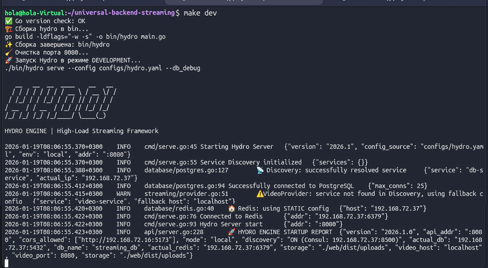

# 🚀 Hydro Engine v2026.1 - Universal Backend Streaming
Высокопроизводительный медиа-движок с динамическим Service Discovery и защищенной архитектурой сессий.
Hydro Universal Streaming — современный, профессиональный бэкенд-бойлерплейт образца 2026 года. 
Это каркас (boilerplate) на Go для медиа-сервисов, ориентированный на надежную доставку контента и гибкое управление инфраструктурой.

## 🏗 Архитектура
Проект построен на принципах **Zero-Trust** и **Cloud-Native**:
- **Backend:** Go 1.25.5 (Чистая архитектура, Chi, Pgx v5).
- **Frontend:** Vue 3 + Vite 6 (Live Proxy Mode).
- **Discovery:** Consul (ACL Protected) с механизмом Graceful Fallback.
- **Session:** Redis v9 (Refresh Token Rotation + HttpOnly Cookies).
* [Больше информации про архитектуру](./docs/README.md#оглавление)

## ⚡ Быстрый старт (Development)
1. **Инфраструктура:** `docker-compose up -d`
2. **База данных:** `make migrate-up` (на сетевой хост)
3. **Запуск:** `make dev` — запускает бэкенд из `bin/`
<div>
  
  <p><i>Общий вид интерфейса программы (версия 2026.1)</i></p>
</div>

## 🛠 Командный интерфейс (Makefile)
- `make build`: Сборка оптимизированного бинарника в `bin/`.
- `make docs-view`: Просмотр документации API прямо в терминале.
- `make check-env`: Проверка текущего резолвинга (Local vs Consul).
- `make lint`: Статический анализ кода на ошибки и утечки памяти.
- `make consul-reg`: Регистрация внешних ресурсов в Service Discovery.
* [Больше информации для разработчика](./docs/DEVELOPMENT.md)

## 🚢 CI/CD & Deploy
Проект полностью автоматизирован через GitLab CI. При каждом пуше в `main`:
1. Проходит стадия **Quality** (Lint/Test).
2. Собирается **Multi-stage Docker** образ.
3. Проводится сканирование безопасности **Trivy**.
4. Выполняется ручной деплой на сервер.

### Качество кода
Перед отправкой кода (Pull Request) обязательно запускайте линтер:
```bash
make lint
```